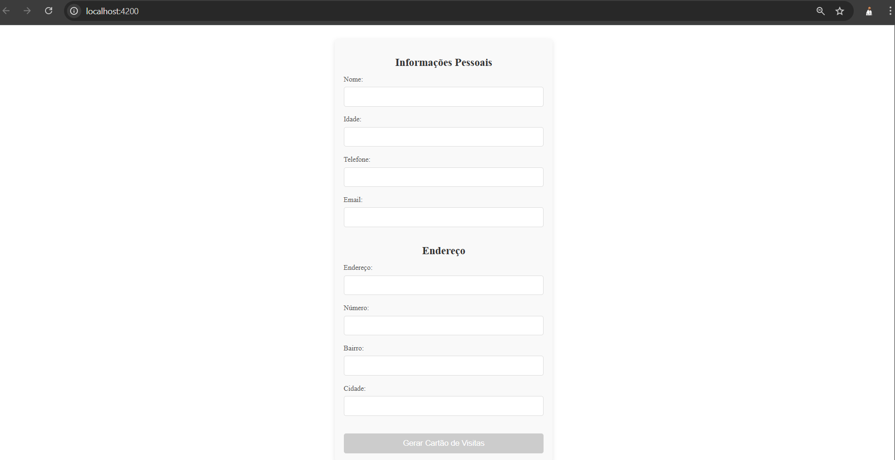
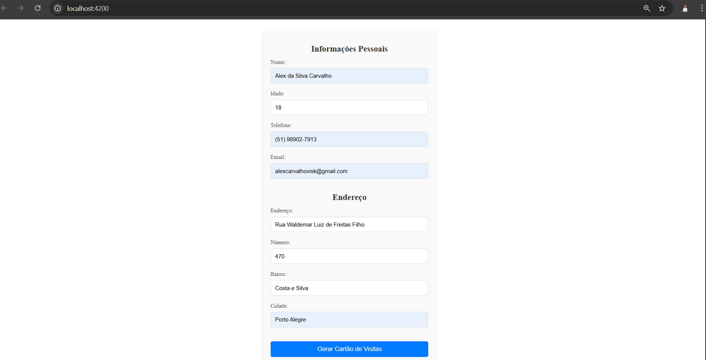
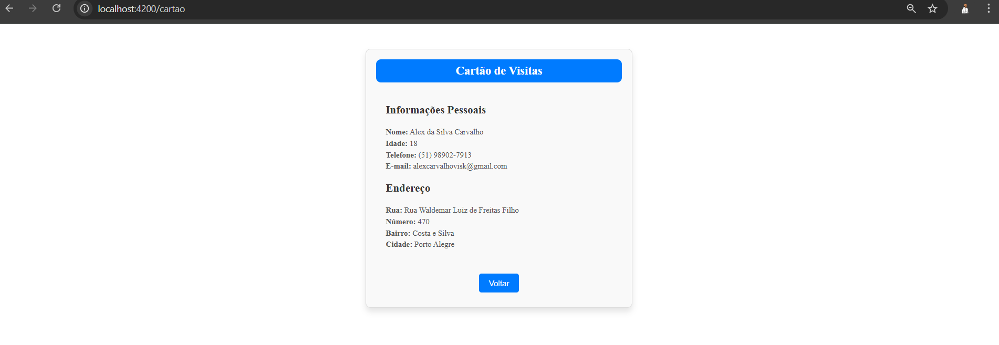

# Projeto Desafio Simfrete Cartão de visitas

### Tecnologias utilizadas

#### Angular 19

#### Node 22

#### TypeScript

## Acessando o projeto

Na raiz do projeto execute ``npm instal`` e após ``ng serve``

O projeto irá subir em :

http://localhost:4200/

## Formulário para preenchimento

Preencha todos os campo do formulário para que o botão seja liberado e o cartão seja visualizado.

## Dados preenchidos com o botão aparente.

## Resultado esperado

